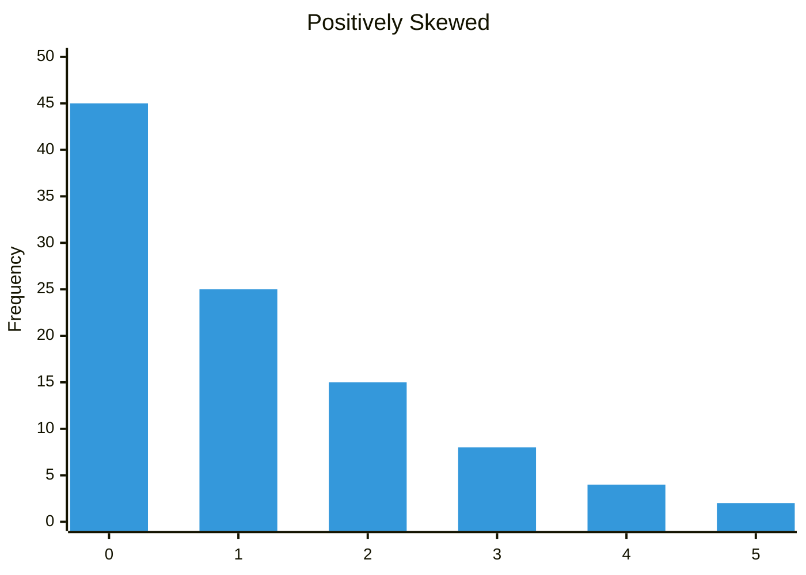
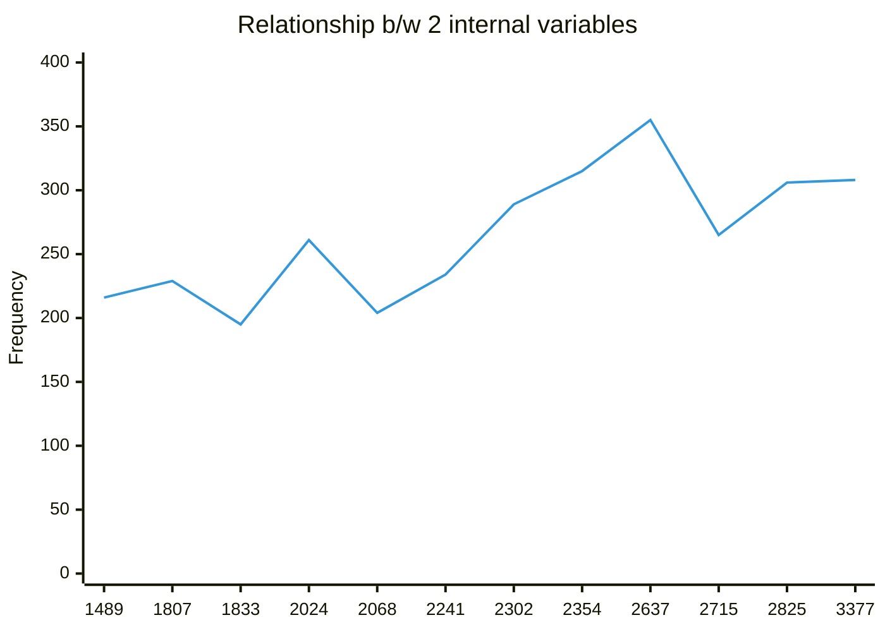

Date: 1 July 2026


# Inferences from Histogram

- Symmetric Histogram
- Positively-Skewed or Negatively-Skewed






|                              |  Interval Data  | Normal Data |
| :--------------------------: | :-------------: | :---------: |
|      Single Set of Data      |    Histogram    |             |
| Relationship b/w 2 variables | Scatter Diagram |             |

# Central Location

## Mean, Median, Mode

```python
import statistics

x = [0, 0, 5, 7, 8, 9, 12, 14, 22, 33]

# Calculate statistics
mean_val = statistics.mean(x)
median_val = statistics.median(x)
mode_val = statistics.mode(x)

print(f"Mean: {mean_val}")
print(f"Median: {median_val}")
print(f"Mode: {mode_val}")
```

### Mean

Best when there is no extreme values

$$\bar{x} = \frac{\sum_{i=1}^{N} x_i}{N}$$

### Median

Best when outlier/ordinary data

$$\text{Median} = 
\begin{cases} 
x_{(\frac{N+1}{2})} & \text{if } N \text{ is odd} \\
\frac{x_{(\frac{N}{2})} + x_{(\frac{N}{2} + 1)}}{2} & \text{if } N \text{ is even}
\end{cases}$$

### Mode

$$\text{Mode} = \text{value with the highest frequency } f(x)$$

---

## Standard Deviation

When two different dataset have same mean, median, mode it's not possible to distinguish them, so we use Std. Dev. 

$$\sigma^2 = \frac{\sum_{i=1}^{N} (x_i - \mu)^2}{N}$$
### Variance

Dist. b/w the datapoints and mean value

$$\sigma = \sqrt{\frac{\sum_{i=1}^{N} (x_i - \mu)^2}{N}}$$

```python
import statistics

x = [17, 15, 23, 7, 9, 13]

var_x = statistics.variance(x)
std_x = statistics.stdev(x)

print(var_x)
print(std_x)
```

## Business Problem

```python
import statistics

current_list = [153, 151, 153, 158, 142, 148, 153, 145, 146, 148, 158, 152, 145, 150, 154, 153, 145, 152, 147, 149, 151, 150, 152, 144, 149]

innovation_list = [150, 149, 155, 145, 153, 150, 152, 147, 153, 151, 158, 150, 147, 151, 155, 151, 149, 154, 149, 148, 151, 150, 152, 146, 150]

mean_curr = statistics.mean(current_list)
mean_inno = statistics.mean(innovation_list)

print(mean_curr)
print(mean_inno)
```


